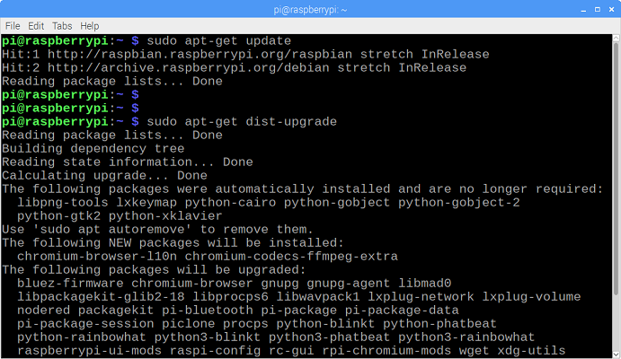

# **Projeto de Controle Preditivo de uma planta HVAC utilizando visão computacional para estimação da carga térmica por pessoa**

## Introdução

## 1 Visão computacional

### Introdução

Neste projeto, foi utilizado, para a estimação da carga termica por pessoa, redes neurais convolucionais (CNN) utilizando a API de detecção de objetos do Tensorflow juntamente com um Raspberry Pi com uma camera usb conectada para realizar a contagem do número de pessoas presentes em um ambiente.
Para a implementação desse algoritmo basta seguir os seguintes passos.

1. [Atualizar o Raspberry Pi](https://github.com/heyder48/TCC#1-Atualizar-o-Raspberry-Pi)
2. [Instalar o TensorFlow](https://github.com/heyder48/TCC#2-Instalar-o-Tensorflow)
3. [Instalar OpenCV](https://github.com/heyder48/TCC#3-Instalar-OpenCV)
4. [Instalar Protobuf](https://github.com/heyder48/TCC#4-Instalar-Protobuf)
5. [Estruturar o diretório do Tensorflow  e a vairável de caminho PYTHONPATH](https://github.com/heyder48/TCC#5-Estruturar-o-diretório-do-Tensorflow-e-a-vairável-de-caminho-PYTHONPATH)
6. [Detectar e Contar pessoas!](https://github.com/heyder48/TCC#6-Detectar-e-Contar-pessoas!)

### Passos

#### 1 Atualizar o Raspberry Pi

Antes de instalar as depedências é recomendado a autalização do Raspberry Pi. Para isso basta abrir o terminal e utilizar os seguintes comandos:

```
sudo apt-get update
sudo apt-get dist-upgrade
```
<p align="center">
  
</p>

#### 2 Instalar o Tensorflow

Para instalar o Tensorflow basta utilizar o seguinte comando:

`pip3 install tensorflow`

O download pode demorar um pouco(>100 MB)

O Tensorflow precisa do pacote LibAtlas. Basta utilizar o seguinte comando:

`sudo apt-get install libatlas-base-dev`

Os outros pacotes necessários para a API de detecção de objetos:

```
sudo pip3 install pillow lxml jupyter matplotlib cython
sudo apt-get install python-tk

```

#### 3 Instalar OpenCV

Para instalar o OpenCV no Raspberry Pi é necessário instalar algumas depedências:

```
sudo apt-get install libjpeg-dev libtiff5-dev libjasper-dev libpng12-dev
sudo apt-get install libavcodec-dev libavformat-dev libswscale-dev libv4l-dev
sudo apt-get install libxvidcore-dev libx264-dev
sudo apt-get install qt4-dev-tools libatlas-base-dev
```
Caso alguma dependência falhe na instalação, utilize o comando `sudo apt-get update` e tente novamente.

Agora podemos instalar o OpenCV.
Para instalar a versão básica do OpenCV basta utilizar o seguinte comando:

`sudo pip3 install opencv-python`


#### 4 Instalar Protobuf

A API de Detecção de Objetos do Tensorflow usa o pacote Protobf, que implementa o formato de dados Protocol Buffer do Google.
Utilize o comando:
`sudo apt-get install protobuf-compiler`

Verifique a instalação:

`protoc --version`

A resposta deve ser da forma libprotoc 3.6.1 ou similar.

#### 5 Estruturar o diretório do Tensorflow e a Variável do caminho PYTHONPATH

Com todos os pacotes instalados e preciso definir as estrutura do diretório do Tensorflow.
Vá para a pasta raiz e crie um novo diretório chamado "tensorflow1" e vá para esse diretório:

```
mkdir tensorflow1
cd tensorflow1
```
Faça o download do reposítorio do Tensorflow no GitHub:

`git clone --depth 1 https://github.com/tensorflow/models.git`

Agora é preciso modificar a variável de ambiente PYTHONPATH de modo a apontar para alguns dos diretórios baixados.
Para isso deve-se modificar o arquivo .bashrc. Abra o arquivo usando o Nano.

`sudo nano ~/.bashrc`

Vá até o fim do arquivo e adicione a seguinte linha:
```
export PYTHONPATH=$PYTHONPATH:/home/pi/tensorflow1/models/research:/home/pi/tensorflow1/models/research/slim
```

<p align="center">
  
</p>

Salve o arquivo. Feche e abra o terminal para efetuar as mudanças.

Agora precisamos utilizar o Protoc, instalado na seção anterior, para compilar os arquivos Protocol Buffer(.proto) utilizados na API. Os arquivos .proto estão localizados em `/research/object_detection/protos` mas precisamos executar o camando do diretório /research. Execute:

```
cd /home/pi/tensorflow1/models/research
protoc object_detection/protos/*.proto --python_out=.
```

Esse comando converte todos os arquivos .proto em arquivos .py. 
Agora vá para o diretório "objetc_detection":
`cd /home/pi/tensorflow1/models/research/object_detection`

Agora devemos fazer o download do modelo utilizado.
O processador do  Raspiberry Pi é fraco logo é necessário utilizar um modelo que necessite um menor poder de processamento.
O modelo escolhido foi o ssdlite_mobilenet_v2_coco_2018_05_09 que foi otimizado para plataformas móveis. Embora o modelo rode de maneira mais rápida sua precisão não será tão acurada quanto aos outros modelos mais pesados.
Faremos o download do modelo do "[TensorFlow detection model zoo](https://github.com/tensorflow/models/blob/master/research/object_detection/g3doc/detection_model_zoo.md)". O zoológico de modelos do Google é uma coleção de modelos pré-treinados para detecção de objetos com vários níveis de velocidade e precisão.

Utilize o seguinte comando para fazer o download do modelo:
```
wget http://download.tensorflow.org/models/object_detection/ssdlite_mobilenet_v2_coco_2018_05_09.tar.gz tar -xzvf ssdlite_mobilenet_v2_coco_2018_05_09.tar.gz
```

#### 6 Detectar e Contar pessoas!

Para utilizar o programa faça o download  do arquivo "InterfaceTCC.py" para o diretório "object_detection":
```
wget https://raw.githubusercontent.com/heyder48/TCC/master/Raspberry/InterfaceTCC.py
```

Para rodar o arquivo:

`python3 InterfaceTCC.py`

<p align="center">
  
</p>


Foi obtido um FPS de aproximadamente 2 (Raspberry Pi 4b com 4 GB de ram) que é suficiente para detecção em tempo real.

**PS: Este arquivo possui outras funcionalidades(Aquisição de dados do arduino e transmisão e recepção UDP) que podem ser desabilitadas comentando ou apagando essas funções**


## 2 Aquisição de Dados
## 3 Controle


